# DemandShaper module

The emoncms demand shaper module uses a day ahead forecast and user set schedules to determine the best time to run household loads. An example could be charging an electric car, the user enters a desired completion time and charge duration, the demand shaper module then works out the best time to charge the car, generally there will be higher power availability overnight and during sunny midday hours. The demand shaper attempts to avoid running appliances at peak times while ensuring that the appliance has completed the required run period.

The demand shaper supports the following forecasts:

- Agile Octopus tariff forecast
- UK Grid Carbon Intensity forecast
- EnergyLocal power availability forecast

The DemandShaper module is part of our work on demand side response and is a relatively new development in the OpenEnergyMonitor ecosystem. For more information on the approach that we are taking as well as ongoing development discussion see the following forum posts:

- [Forum post: OpenEnergyMonitor Demand Side Response Development](https://community.openenergymonitor.org/t/openenergymonitor-demand-side-response-development/9095) 
- [Forum post: Demand Shaper module development](https://community.openenergymonitor.org/t/emoncms-demand-shaper-module/9097)

## Smart EV Charging

The following guide covers how to setup the Emon/OpenEVSE charging station and [Emoncms DemandShaper module](/integrations/demandshaper/) to smart charge an electric vehicle based on day-ahead forecasts for the best time to use power.

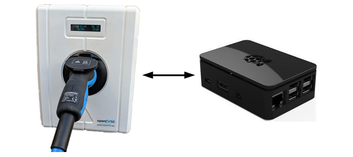

**You will need:**
 
- [OpenEVSE or EmonEVSE open source EV charging station](/integrations/ev-charging/)
- emonBase or emonPi base-station running [emonSD-17Oct19 or newer](https://github.com/openenergymonitor/emonpi/wiki/emonSD-pre-built-SD-card-Download-&-Change-Log#emonsd-17oct19-stable).
- Optional: [OVMS Open Vehicle Monitoring System](https://shop.openenergymonitor.com/open-vehicle-monitor-ovms-wifi-3g-europe) for automatic reading of EV battery state of charge.

**OVMS:** The [OVMS Open Vehicle Monitor](https://shop.openenergymonitor.com/open-vehicle-monitor-ovms-wifi-3g-europe/) is a module that plugs into the ODB2 port of an EV. It can access a lot of detailed information about the vehicle and battery status for a wide variety of EV models. The DemandShaper module integrates with OVMS [European Server (dexters-web)](https://dexters-web.de/)in order to access the state-of-charge (SoC) to calculate how long a charge session needs to be.

**Custom SoC integration:** It is also possible to provide the DemandShaper module with a state-of-charge value using an emoncms input e.g `openevse-xxxx/soc`. If you have a script that reads the state-of-charge you can pass it on to the DemandShaper module using this approach. You can create an Emoncms input `openevse-xxxx/soc` by posting the SoC to MQTT topic `emon/openevse-xxx/soc`
 
### Setup
 
1\. Start by connecting your OpenEVSE to your home WiFi network and configuring the MQTT settings following the [OpenEVSE setup guide](https://guide.openenergymonitor.org/integrations/evse-setup/).

2\. Navigate to the emoncms inputs page where a set of OpenEVSE inputs will appear including charge current, energy used and charger state. 

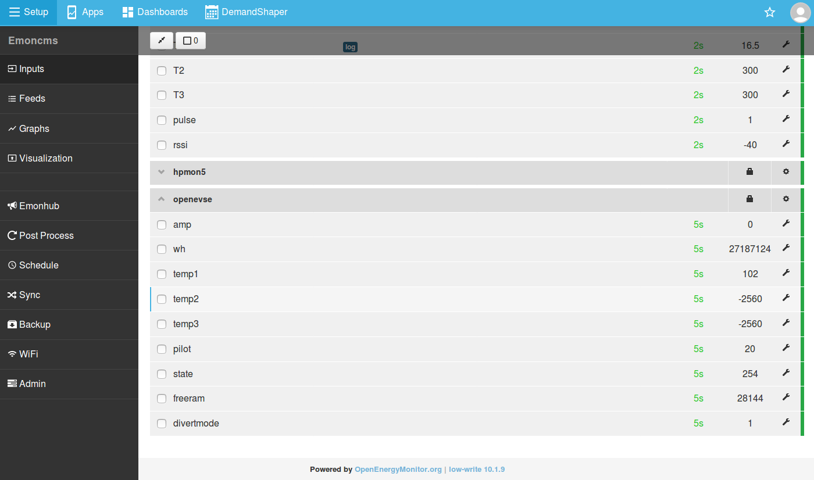

3\. Click on the Cog to the top-right of the inputs to bring up the 'Configure Device' window. Select the EVSE > OpenEVSE > Default device template.

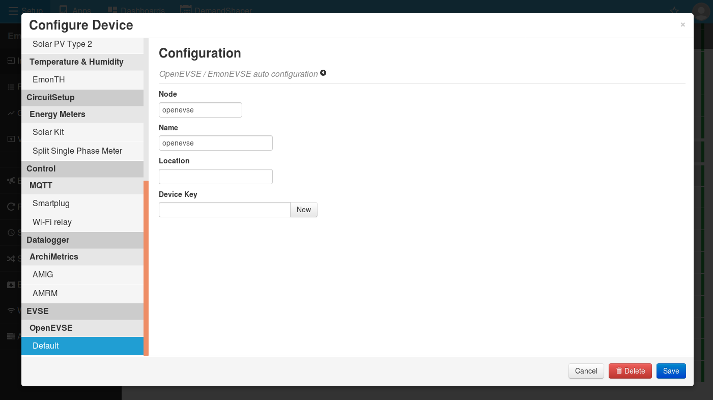

4\. Optional: To create a set of feeds from the OpenEVSE charger so that you can monitor it's use over time: click Save and then Initialize to confirm.

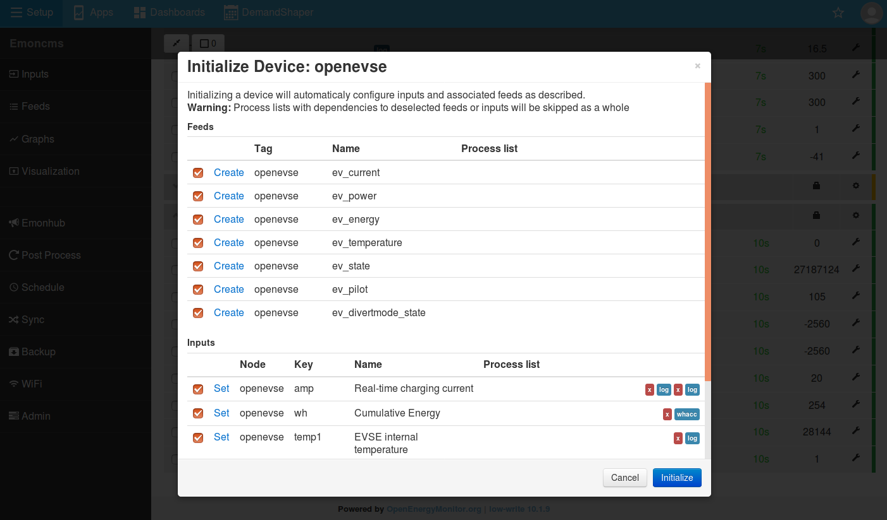

5\. Navigate to the DemandShaper module in the top bar, the OpenEVSE device should now appear in the left hand menu. If it is not present try refreshing the page. Click on the OpenEVSE menu item to bring up the scheduler interface.

Select the demand shaper signal you wish to use. If you are using the Octopus Agile tariff, select the relevant region from the drop down menu.

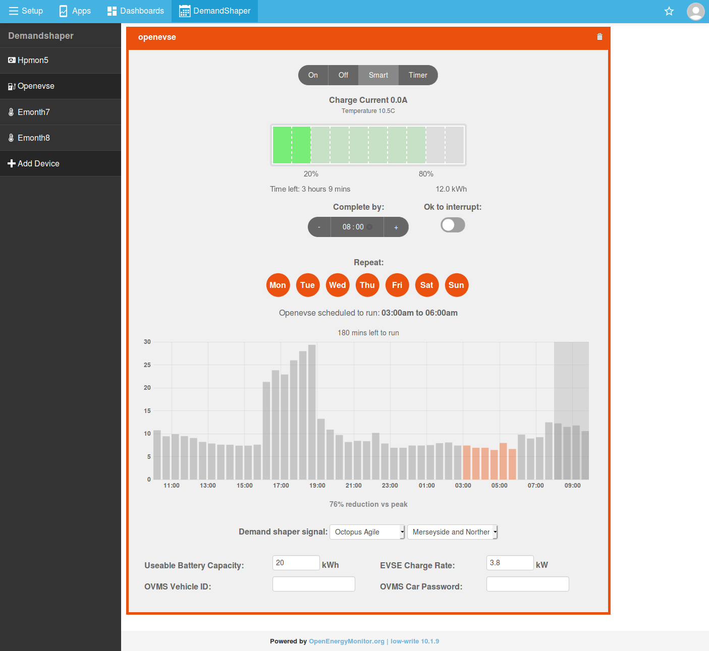

To enable automatic reading of EV state of charge with OVMS enter your OVMS Vehicle ID and car password at the bottom of the page. Wait 5s for the settings to save and then refresh the page. You should now see the current SOC on the battery bar widget:

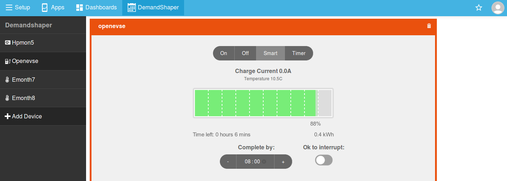

Thats it, to schedule a charge enter the time that you wish the charge to complete by and select the battery % that you wish to reach.

If the Demand Shaper is operating correctly the timer should now be set on the OpenEVSE for the scheduled charging time, you can check this on the OpenEVSE WiF interface page. 

The DemandShaper Interface and the OpenEVSE interface should not be used at the same time since this can cause conflicts.Switch the Demand Shaper to "Off" if you wish to use the OpenEVSE WiFi interface to control the EVSE..

## Sonoff WiFi Smart Plug

The following guide covers setup of the Sonoff S20 WiFi Smart Plug and [Emoncms DemandShaper module](/integrations/demandshaper/) for smart scheduling based on day-ahead forecasts for the best time to use power.

**Potential applications:** De-humidifiers, Ebike battery charging. Note that Sonoff S20 smart plugs have a 10A maximum current capacity and a standby power draw of ~1W.

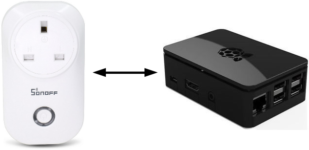

**You will need:**

- Sonoff S20 WiFi Smart plug running latest [EmonESP firmware](https://github.com/openenergymonitor/EmonESP).
- emonBase or emonPi base-station running [emonSD-17Oct19 or newer](https://github.com/openenergymonitor/emonpi/wiki/emonSD-pre-built-SD-card-Download-&-Change-Log#emonsd-17oct19-stable).
- USB Power supply and micro-USB cable for base-station.

### Setting up your emonBase or emonPi base-station

Start by setting up your emonBase or emonPi following the [Software Setup > Connect](/setup/connect/) guide. Create an local emoncms account on your emonBase/emonPi and run the software updater from the Admin page to make sure that you have the latest software.

### Setting up your WiFi Smart Plug

1\. Plug your smart plug into an electrical socket. The light on the plug will show green for 3 seconds followed by a short off period and then a couple of very short flashes. This indicates that the plug is working and has created a WIFI Access Point.

2\. The WIFI Access Point should appear in your laptop or phones available WIFI networks, the SSID will contain the name smartplug followed by a number e.g: 'smartplug1'.

3\. Connect to this network, open an internet browser and enter the following address:

**[http://192.168.4.1](http://192.168.4.1)**

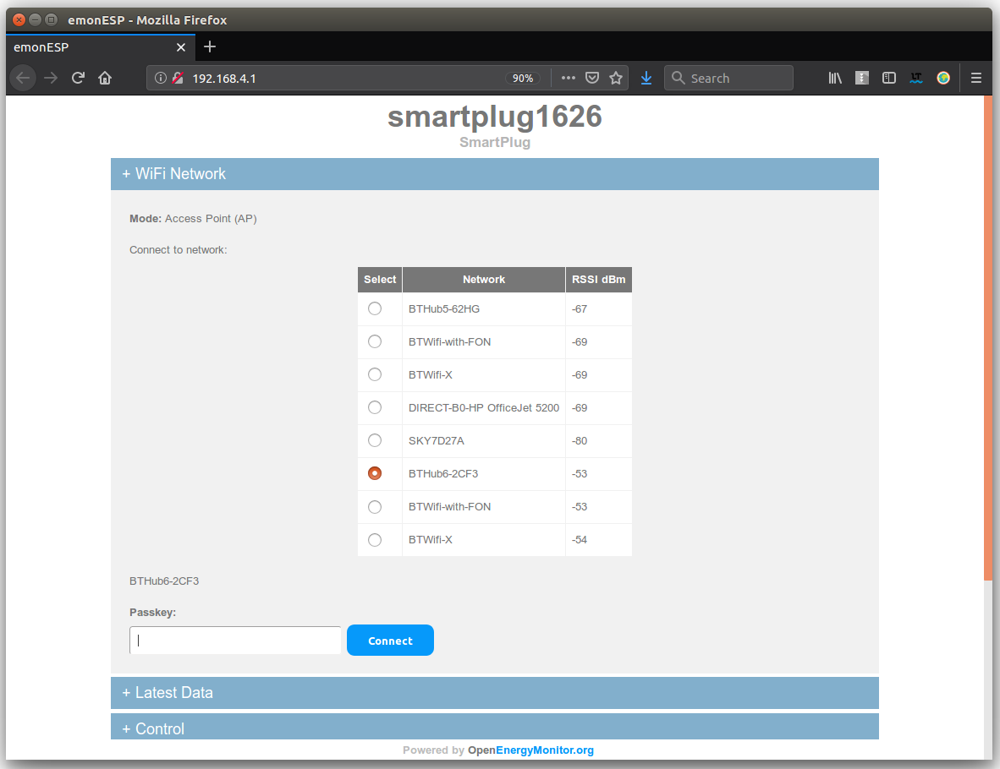

4\. Select the WIFI network you wish to connect to, enter the passkey and click connect. 

The green light on the smartplug will now turn on again. If the connection is successful you will see 10 very fast consecutive flashes. 

5\. The web interface will also show that the module has connected and its IP address:

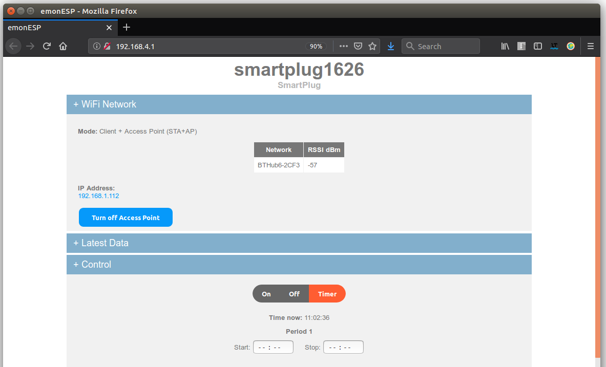

**Failed Connection** 
If the smartplug fails to connect to the selected WIFI network the green LED will stay on with a slight pulsing rythym for 30 seconds before the plug automatically resets and tries again. To re-enter setup mode hold the button on the front of the smartplug down while the green LED is on.

### Pairing the Smart Plug with your emonBase/emonPi

With the smartplug WIFI settings configured connect back to you home network, login to the local emoncms on your emonBase/emonPi and navigate to the DemandShaper module:

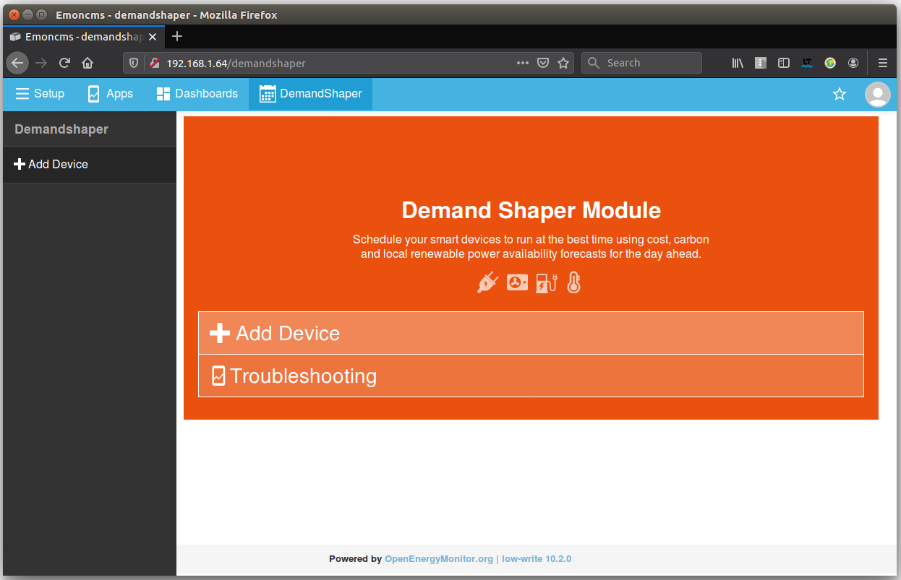

After a couple of minutes a notice will appear asking whether to allow device at the given ip address to connect:

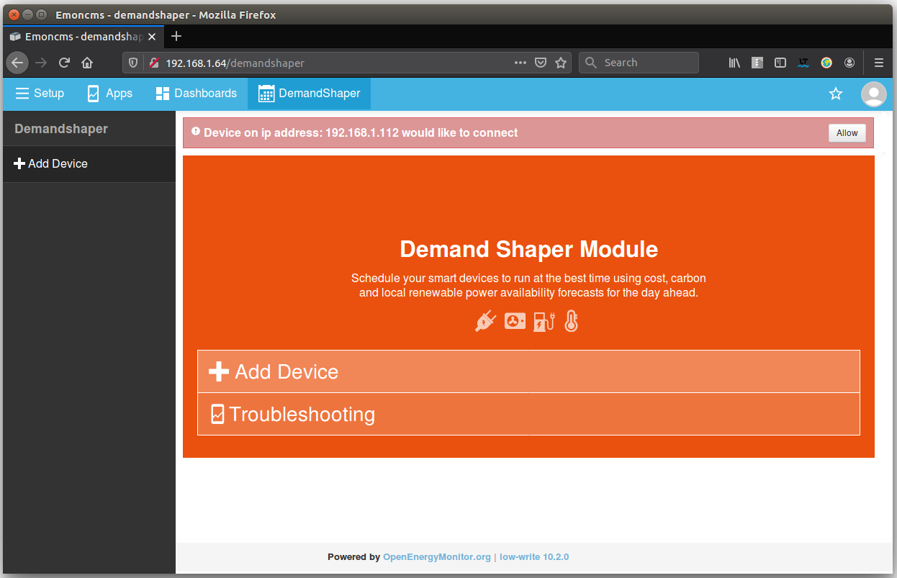

Click allow and wait a couple of minutes for the device to appear. If it does not appear, try refreshing the page.

*What happened here?:*

1. *The smart plug discovers the emonbase/emonpi automatically by listening out for the periodic UDP packet published by the emonbase/emonpi, enabled by the UDP broadcast script and triggered by keeping the demandshaper page open*
2. *Clicking on Allow provides the smart plug with the MQTT authentication details from the emonbase/emonpi automatically as part of a pairing process.* 
3. *After connecting to MQTT the smartplug sent a descriptor message that automatically created and configured an emoncms device based on the smartplug device template in the emoncms device module*

### Using the DemandShaper

**Option 1: Turn On/Off directly** 
The most basic mode of operation, turn on/off device from the interface:

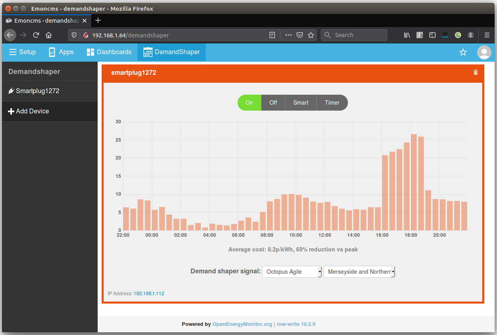

**Tip:** The smartplug can be turned on and off at the plug as well by clicking the push button on the front of the smartplug. Refresh the page to see changes in the dashboard.

**Option 2: Use the smart scheduler** 
Enter the period and end time of the schedule you wish to set and the demand shaper module will do the rest, automatically optimising the schedule for the lowest cost or lowest carbon time.

**Option 3: Set a manual timer:** 
Set a manual timer for specific run times:

 

## Further Development

The DemandShaper modules is currently in an early beta stage of development for more information on features planned and for support using the module see the forum post: [Emoncms Demand Shaper module](https://community.openenergymonitor.org/t/emoncms-demand-shaper-module/9097).

The source code for the DemandShaper module is available on github here: [https://github.com/emoncms/demandshaper](https://github.com/emoncms/demandshaper)
